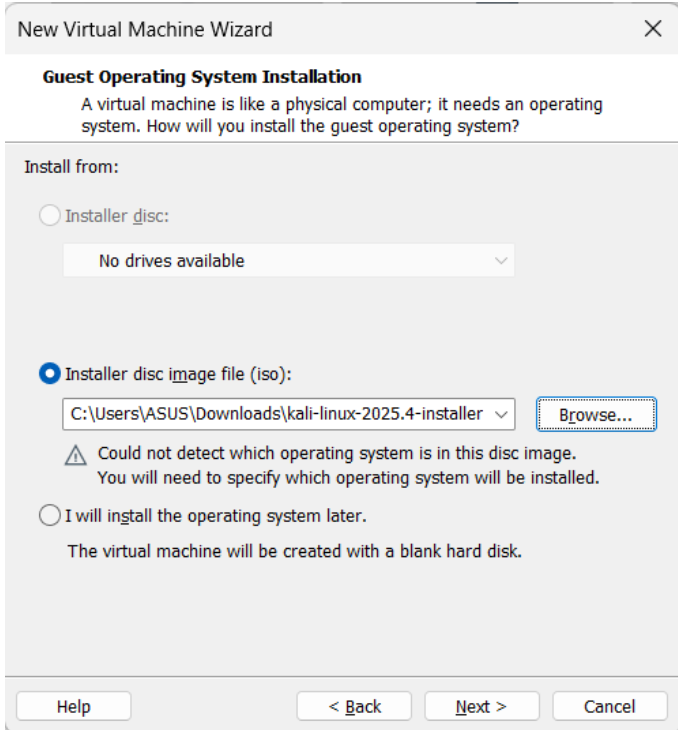
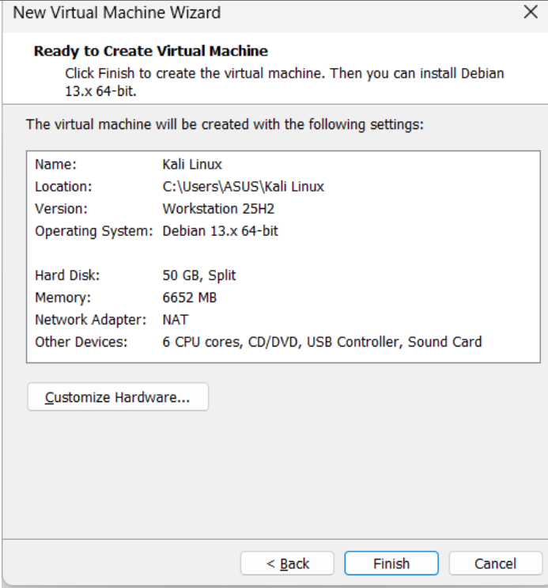
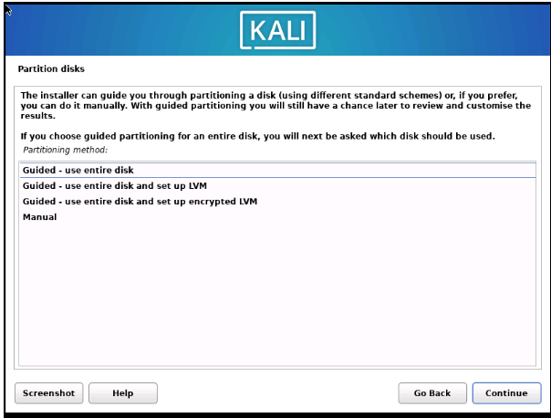
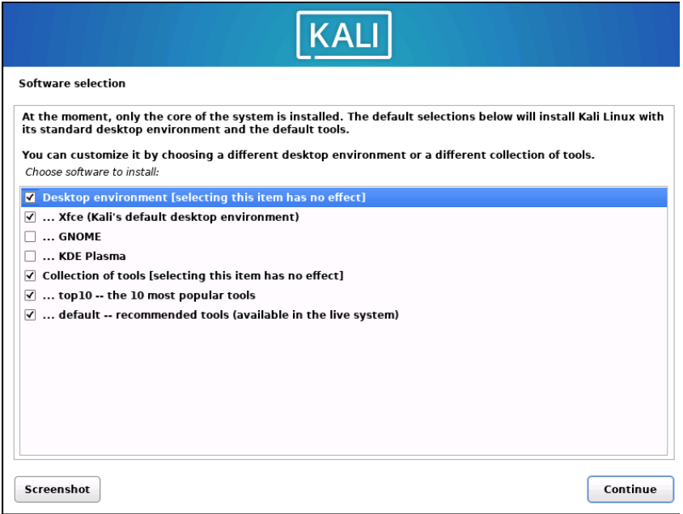
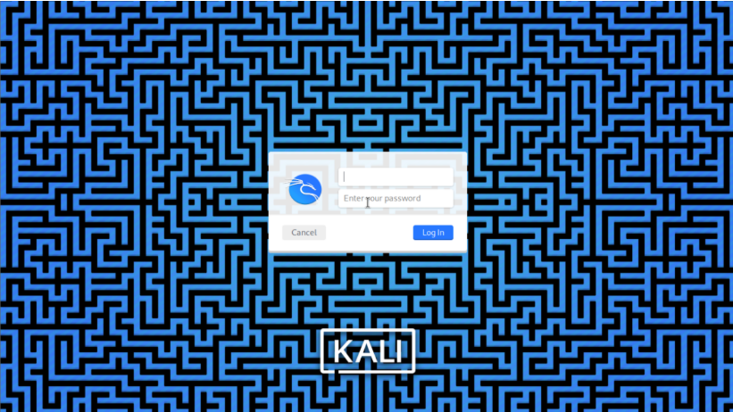
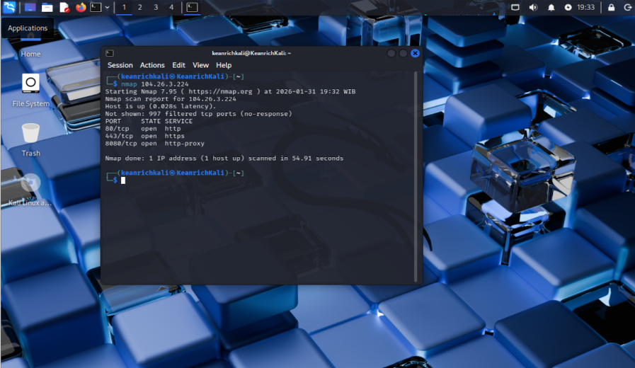

# Active Reconnaissance Simulation Using Nmap

This project demonstrates how to set up a **Kali Linux penetration testing environment** and perform **Active Reconnaissance using Nmap** in a controlled lab environment.

The goal of this lab is to understand the **reconnaissance phase of penetration testing**, where attackers or security professionals gather information about a target system.

---

# Table of Contents

- [Overview](#overview)
- [Lab Environment](#lab-environment)
- [Tools Used](#tools-used)
- [Lab Setup](#lab-setup)
- [Kali Linux Installation](#kali-linux-installation)
- [Active Reconnaissance Using Nmap](#active-reconnaissance-using-nmap)
- [Nmap Scan Result](#nmap-scan-result)
- [Screenshots](#screenshots)
- [Conclusion](#conclusion)
- [Disclaimer](#disclaimer)

---

# Overview

Network Penetration Testing is a security testing technique used to evaluate how well a network can prevent and defend against cyber attacks. The purpose of this activity is to identify vulnerabilities before they can be exploited by attackers.

One of the first stages in penetration testing is **Reconnaissance**, which focuses on gathering information about the target system or network.

There are two types of reconnaissance:

### Passive Reconnaissance
Collecting information without interacting directly with the target system. Examples include OSINT and public data gathering.

### Active Reconnaissance
Directly interacting with the target system to discover information such as open ports, running services, and system details.

In this lab we perform **Active Reconnaissance using Nmap**.


# Tools Used

The following tools were used in this lab:

- Kali Linux
- VMware Workstation Pro
- Nmap

Minimum recommended hardware:

- CPU: 4 Cores
- RAM: 8 GB
- Storage: 50 GB

---

# Lab Setup

## 1 Create Virtual Machine

Open **VMware Workstation Pro** and select:

```
Create a New Virtual Machine
```


## 2 Select Kali Linux ISO

Download Kali Linux from the official website and select the ISO file during VM creation.



## 3 configure the VM kali specification

Setup the specification such as network, CPU/core, RAM, Storage, os and etc.



# Kali Linux Installation

## 1 Start Installation
Start the virtual machine and choose:
```
Graphical Install
```

## 2 Configure System
Configure the following settings:

- Language: English
- Keyboard: American English
- Timezone: Asia → Indonesia
- Username
- Password


## 3 Disk Partition and software selection
Choose:
```
Guided - Use Entire Disk
```



Select all except: Gnome and KDE Plasma



## 4 Install GRUB Boot Loader
When prompted, select:
```
Yes
```
GRUB is required to boot the operating system.


## 5 Kali Linux Desktop

After installation completes, login to Kali Linux.




# Active Reconnaissance Using Nmap

After Kali Linux installation is complete, we can start performing reconnaissance activities.

---

## Update Repository

Run the following command:

```bash
sudo apt update
```

---

## Check Nmap Installation

Check if Nmap is installed:
```bash
nmap -v
```
If not installed:
```bash
sudo apt install nmap
```


---

# Nmap Scan Result

Run the following command to scan a target:

```bash
nmap <target_ip>
```
Nmap will scan the target and identify:

- Open ports
- Running services
- Network exposure





# Conclusion

This lab demonstrates how to set up a **Kali Linux penetration testing environment** and perform **Active Reconnaissance using Nmap**.

Through this process we learned how security professionals gather important information about a target system before moving to more advanced penetration testing stages such as vulnerability exploitation or privilege escalation.

---

# Disclaimer

This project was conducted in a **controlled lab environment for educational purposes only**.

Do not perform scanning or penetration testing on systems without proper authorization.

---

**Author**

Cybersecurity Learning Project